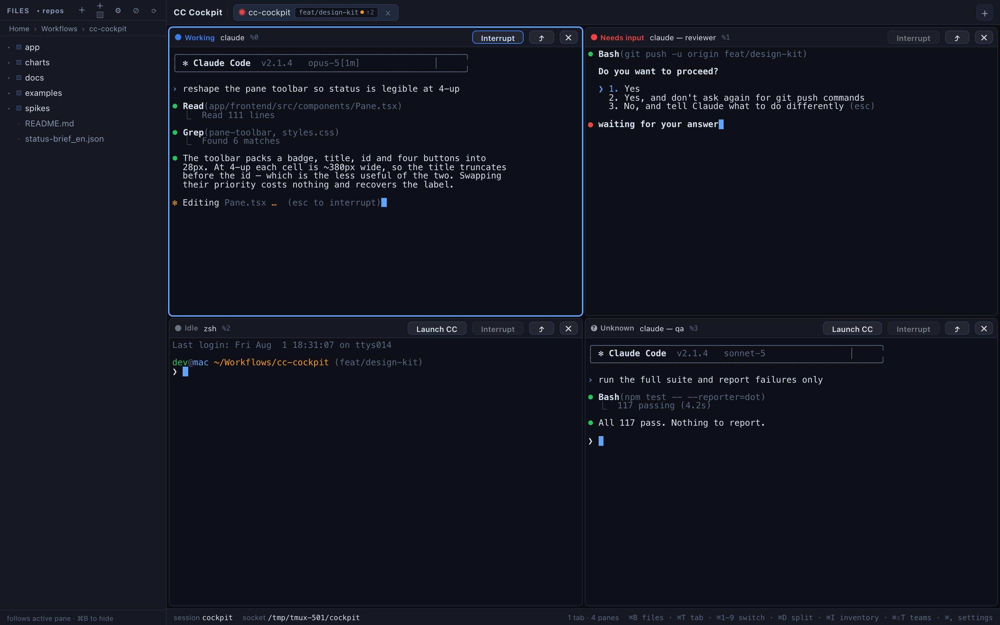
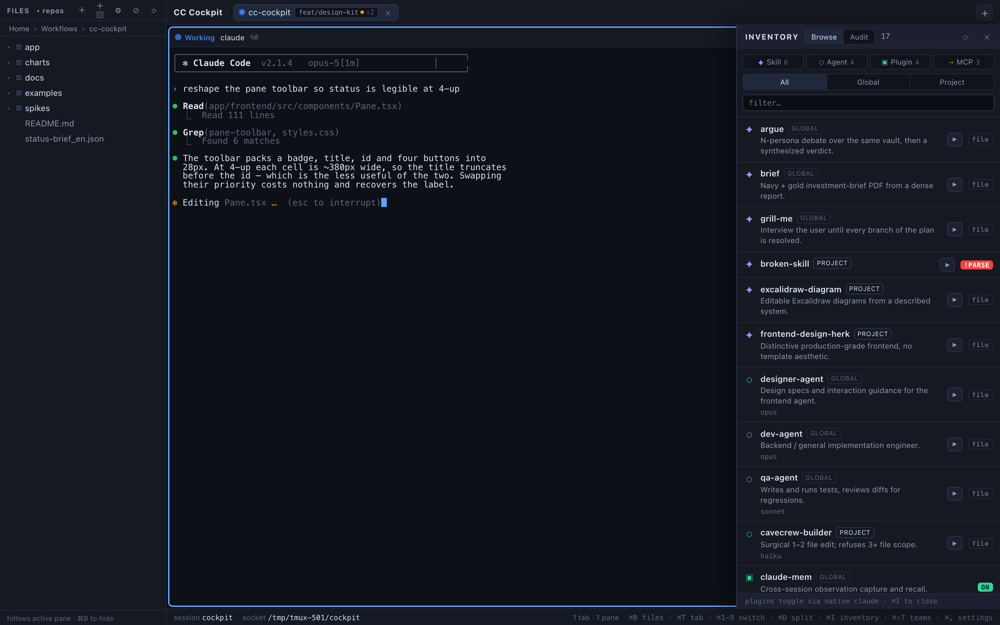
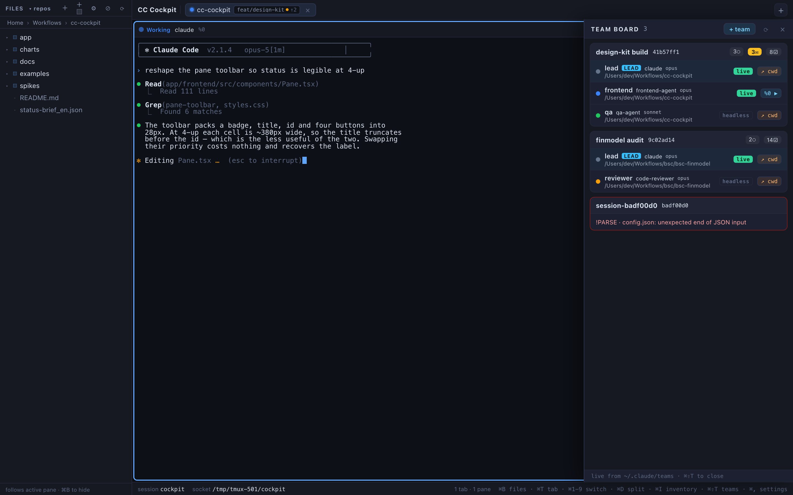

# CC Cockpit

A macOS desktop cockpit for running many [Claude Code](https://claude.com/claude-code) sessions in parallel — tabs, tiled panes, live agent status, agent-team launching, and a cross-project inventory of your skills/agents/plugins/MCP servers. Built with Tauri 2 + SolidJS + xterm.js on top of a single tmux session.



## Why

Running several Claude Code agents at once in raw terminal windows means you lose track of which one is working, which one is stuck waiting for your answer, and which one died. CC Cockpit turns that into a single window: every pane shows a live status badge (**Working / Needs input / Idle / Dead**), parsed from the real terminal stream — so you can glance, jump to the agent that needs you, and get back to work.

Everything runs inside one tmux session (`-L cockpit`), so the terminal state is the source of truth and the GUI is just a view over it.

## Features

- **Tabs + tiled panes** — one tab per project/context, split panes inside (⌘T / ⌘D), each pane a real `claude` process or plain shell.
- **Live agent status** — Working/Idle/Needs-input detection from the terminal stream, plus one-click Interrupt.
- **Agent teams** — save reusable team **rosters** (who) and **workflows** (how) as YAML in `~/.claude/cockpit/`, spin up a lead + teammates in one dialog, and watch live runs on the team board (⌘⇧T). Uses Claude Code's native Agent Teams under the hood.
- **Inventory mission-control (⌘I)** — browse every skill, subagent, plugin, and MCP server across your projects in one panel; toggle plugins (delegated to the `claude` CLI, confirm-first); audit which project has what enabled.
- **File tree sidebar (⌘B)** — follows the active pane's cwd, click-to-`cd`, breadcrumb + repo picker, insert `@path` into a Claude prompt, live fs-watch.
- **Dark + light theme** — fully tokenized palette, terminals re-theme in place (⌘, → Settings).
- **Resilience** — startup self-heal of a poisoned tmux socket, runtime reconnect if the server dies, layout persisted across restarts.

| | |
|---|---|
|  |  |

## Requirements

- macOS on Apple Silicon (arm64 builds only for now)
- [tmux](https://github.com/tmux/tmux) ≥ 3.3 — `brew install tmux`
- [Claude Code](https://claude.com/claude-code) CLI — `npm install -g @anthropic-ai/claude-code`

## Install

Grab the `.dmg` from [Releases](../../releases), drag to Applications.

The app is currently **ad-hoc signed** (no Apple Developer ID), so Gatekeeper will complain on first launch. Clear the quarantine flag once:

```sh
xattr -dr com.apple.quarantine "/Applications/CC Cockpit.app"
```

On first run, open Settings (⌘,) and pick your default projects folder — new tabs open there.

## Build from source

Prereqs: Rust (stable), Node ≥ 20, tmux.

```sh
cd app
npm install
npm run dev        # dev build with hot reload
npm run build      # release build → .dmg in src-tauri/target/release/bundle/
```

> ⚠️ `npm run dev` attaches to the **same** tmux session as an installed copy of the app — quit the installed app first, or the two instances will fight over the panes. And quit any running copy before `npm run build`, or the dmg bundler fails.

## Keyboard shortcuts

| Keys | Action |
|---|---|
| ⌘T | New tab |
| ⌘D | Split pane |
| ⌘W | Close pane / tab |
| ⌘1…9 | Switch tab |
| ⌘B | File tree sidebar |
| ⌘I | Inventory panel |
| ⌘⇧T | Team board |
| ⌘, | Settings |

## Architecture (short version)

One tmux session `cockpit-main` on a dedicated socket (`tmux -L cockpit`), driven over **control mode** (`-CC`) by the Rust backend. The frontend renders panes with xterm.js and never talks to tmux directly — every mutation goes through typed Tauri IPC commands. Config writes (plugin toggles, agent launches) are delegated to the `claude` CLI as argv (no shell interpolation). Agent-team runs are read from Claude Code's native `~/.claude/teams/` state — the cockpit adds templates and a GUI, not a competing runtime.

More detail in [`docs/`](docs/).

## License

[MIT](LICENSE)
